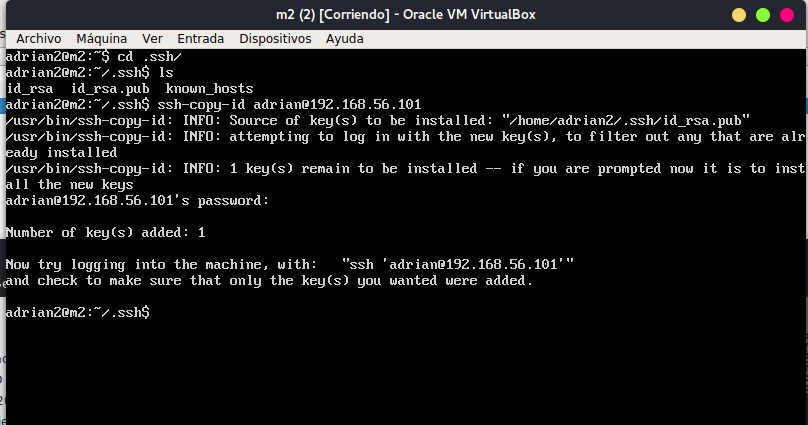

#Practica 2: Clonación de la información de un sitio web

##Crear un tar con ficheros locales en un equipo remoto:

Para ello utilizamos el comando tar de a siguiente manera:
*tar -czvf archivo.tar ./carpeta/*

-c : indica a tar que cree un archivo.
-z : indica que use el compresor gzip
-f : indica a tar que el siguiente argumento es el nombre del fichero.tar
-v : indica a tar que muestre lo que va empaquetando

Para realizar esta tardea en remoto lo utilizaremos de esta manera:

*tar -czv ./carpeta/ | ssh usuario@ip_maquina_destino '  cat > archivo.tgz '*

En el comando tar no tenemos que especificar nombre de archivo, ya que la salida la vamos a redirigir con un pipeline hacia un ssh, el cual relizaa un con cat (con el flujo de salida del comando tar) y a su vez este flujo será rediriguido a un archivo.tar

##Uso de rsync para clonado de un directorio:

realizamos el comando *rsync -avz -e ssh ip_maquina_origen:/ruta/del/directorio/ /ruta/local/destino/*

[IMFORMACION APLICACION](https://rsync.samba.org)

##Uso de ssh sin contraseña

Lo primero que tenemos que hacer es crear una clase privada y una clave publica de nuestro servidor que se va a conectar al "maestro" para ello realizamos lo siguiente:
![imagen generacion de claves] ( gen_claves.png )

Después tenemos que añadir la clae publica al servidor origen, para ello desde el servidor destino ejecutamos este comando:

Y con esto ya podremos conectarnos sin contraseña!

![imagen conexion sin password ] ( conexion_sin_pass.png )

Tambien podemos ejecutar un comando remoto de esta manera:
*ssh username@ip_maquina_origen comando -modificadores*
y obtendremos por nuestra salida de pantalla el comando.

